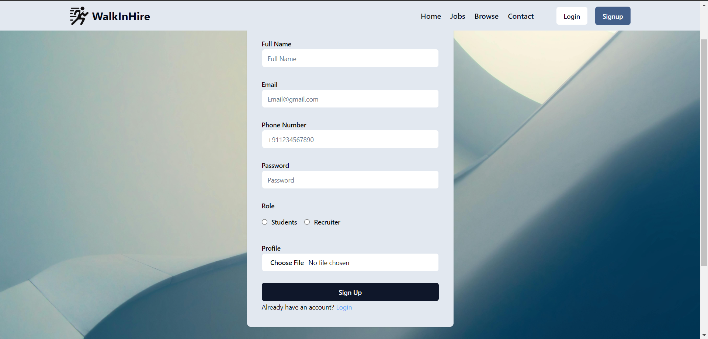
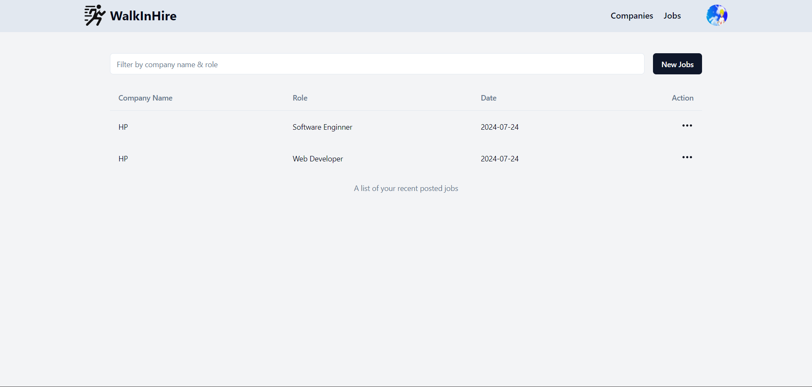

# WalkInHire


WalkInHire is a job portal platform designed to facilitate walk-in interviews. The platform connects job seekers with employers, making it easier for both parties to schedule and manage interviews in a convenient and streamlined way.

## Features

- **Job Listings:** Browse and search for walk-in interview opportunities.
- **Employer Dashboard:** Post new job listings and manage existing ones.
- **Job Seeker Profiles:** Create and update profiles to apply for jobs.
- **Search and Filter:** Easily find job listings based on location, industry, and more.

## Getting Started

To get a local copy of WalkInHire up and running, follow these steps:

1. **Clone the repository:**

   ```bash
   git clone https://github.com/yourusername/walkinhire.git
   ```








